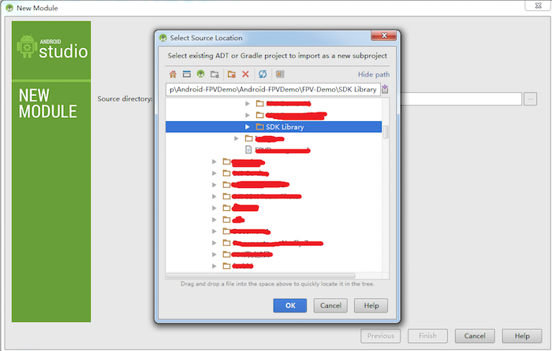
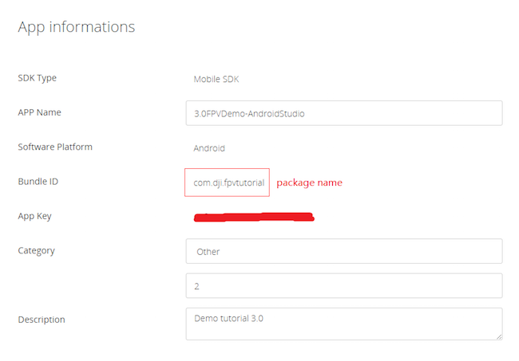

# Creating a Camera Application

<!-- toc -->

*If you come across any mistakes or bugs in this tutorial, please let us know using a Github issue or a post on the DJI forum, or commenting in the Gitbook. Please feel free to send us Github pull request and help us fix any issues. However, all pull requests related to document must follow the [document style](https://github.com/dji-sdk/Mobile-SDK-Tutorial/issues/19)*

---

This tutorial uses Phantom 3 Professional as an example. 
You can download the final project for this tutorial from this Github page. 
We **strongly** recommend that you download the final project code and have it open as reference as you work through this tutorial.
## Preparation
(1) Download the Mobile SDK for Android from the following URL: 
<https://developer.dji.com/mobile-sdk/downloads>
(2) Update the firmware of the product (Phantom 3 Series, Inspire 1, Inspire Pro, M100, OSMO) through the URL: <https://developer.dji.com/mobile-sdk/downloads/> (*Refer to "How to Update the Firmware": <http://www.dji.com/product/phantom-3-pro/info#downloads> for instructions on updating the Phantom 3 Professional's firmware.*)
(3) Set up an Android development environment (if you do not yet have one). Throughout this tutorial we will be using Android Studio 1.5.1, which you can download here: <http://developer.android.com/sdk/index.html>.

## Setting up your Programming Environment

### Android Studio
(1) Start a new Android Studio Project. Give the application and company domain any name you like, click next. Set the minimum SDK version as API 19 (recommended) and click next. Select "Empty Activity" and click next. As you reach the 'Customize the Activity' page, you should name your activity 'FPVTutorialActivity'. The layout name should automatically fill out with 'activity_fpvtutorial'. Press 'Finish'.

(2) Unzip the SDK package downloaded from the DJI website. Go to File -> New -> Import Module. In the 'Source Directory' field, find the DJI-SDK-LIB folder location. Press Finish.


(3) Next, right click on the 'app' module in the file directory to the left, and click 'Open Module Settings'. Navigate to the 'Dependencies' tab. Press the green plus sign, click 'Module Dependency', and select ':DJI-SDK-LIB'. Press 'OK' to confirm. After Gradle finishes rebuilding, your environment will be ready!

## Configure the Project's AndroidManifest File

You need to configure your project's AndroidManifest file by adding the following permissions and features for DJI SDK V3.

~~~xml

<!-- DJI SDK permissions -->
<uses-permission android:name="android.permission.VIBRATE" />
<uses-permission android:name="android.permission.INTERNET" />
<uses-permission android:name="android.permission.ACCESS_WIFI_STATE" />
<uses-permission android:name="android.permission.WAKE_LOCK" />
<uses-permission android:name="android.permission.ACCESS_COARSE_LOCATION" />
<uses-permission android:name="android.permission.ACCESS_NETWORK_STATE" />
<uses-permission android:name="android.permission.ACCESS_FINE_LOCATION" />
<uses-permission android:name="android.permission.CHANGE_WIFI_STATE" />
<uses-permission android:name="android.permission.MOUNT_UNMOUNT_FILESYSTEMS" />
<uses-permission android:name="android.permission.WRITE_EXTERNAL_STORAGE" />
<uses-permission android:name="android.permission.READ_EXTERNAL_STORAGE" />
<uses-permission android:name="android.permission.SYSTEM_ALERT_WINDOW" />
<uses-permission android:name="android.permission.READ_PHONE_STATE" />
<uses-feature android:name="android.hardware.camera" />
<uses-feature android:name="android.hardware.camera.autofocus" />
<uses-feature
    android:name="android.hardware.usb.host"
    android:required="false" />
<uses-feature
    android:name="android.hardware.usb.accessory"
    android:required="true" />
<!-- DJI SDK -->
~~~
DJI SDK V3 uses USB Accessory method to connect a Remote Controller with a mobile device. Please add the following codes under tag **application** to support this feature, especially pay attention to tag **<uses-library />**, and **intent-filter**, **<meta-data />** within the tag **activity** for **dji.sdk.SDKManager.DJIAoaControllerActivity**.
~~~xml

    <application
        android:name="com.dji.fpvtutorial.FPVTutorialApplication"
        android:allowBackup="true"
        android:icon="@mipmap/ic_launcher"
        android:label="@string/app_name"
        android:supportsRtl="true"
        android:theme="@style/AppTheme">
        <!-- DJI SDK API Key-->
        <uses-library android:name="com.android.future.usb.accessory" />
        <meta-data
            android:name="com.dji.sdk.API_KEY"
            android:value="" />
        <activity
            android:name="dji.sdk.SDKManager.DJIAoaControllerActivity"
            android:theme="@android:style/Theme.Translucent" >
            <intent-filter>
                <action android:name="android.hardware.usb.action.USB_ACCESSORY_ATTACHED" />
            </intent-filter>
            <meta-data
                android:name="android.hardware.usb.action.USB_ACCESSORY_ATTACHED"
                android:resource="@xml/accessory_filter" />
        </activity>
		<!-- DJI SDK -->
        <activity android:name=".FPVTutorialActivity"
            android:theme="@android:style/Theme.NoTitleBar.Fullscreen">
            <intent-filter>
                <action android:name="android.intent.action.MAIN" />
                <category android:name="android.intent.category.LAUNCHER" />
            </intent-filter>
        </activity>
    </application>
    
~~~
The above code shows where to add the API Key for registration. The API Key can be applied as follows:
Register for an account at <https://developer.dji.com/register>. Once registered, click on your name in the upper right corner. Click on 'Mobile SDK', then 'Create APP' and fill out the creation form. Type in your project's package name in the 'Identification Code' field.
Fill in the **android:value** field with the APP KEY that you have applied for from <http://developer.dji.com/en/user/apps>.


## Write Code for Showing Video

###(1) Initiate DJI SDK
DJI SDK V3 uses class **DJISDKManager** to manage the SDK's initiation, activation, and connection or disconnection to DJI's product.

Before using DJI SDK V3, developers first need to initiate it by using function **initSDKManager** of class **DJISDKManager**. Interface **DJISDKManagerCallback** is used to listen to the SDK registration result and the connected product changing. An example code snippet is as follows, we recommend developers to implement these codes in the application of Android, which will be active when the mobile app is not closed. 

~~~java

@Override
public void onCreate() {
    super.onCreate();
    mHandler = new Handler(Looper.getMainLooper());
    //This is used to start SDK services and initiate SDK.
    DJISDKManager.getInstance().initSDKManager(this, mDJISDKManagerCallback); 
}
/**
 * When starting SDK services, an instance of interface DJISDKManager.DJISDKManagerCallback will be used to listen to 
 * the SDK Registration result and the product changing.
 */
private DJISDKManager.DJISDKManagerCallback mDJISDKManagerCallback = new DJISDKManager.DJISDKManagerCallback() {
	//Listens to the SDK registration result
    @Override
    
    public void onGetRegisteredResult(DJISDKError error) {
        if(error == DJISDKError.REGISTRATION_SUCCESS) {
            DJISDKManager.getInstance().startConnectionToProduct();
        } else {
            Handler handler = new Handler(Looper.getMainLooper());
            handler.post(new Runnable() {
            
                @Override
                public void run() {
                    Toast.makeText(getApplicationContext(), "register sdk fails, check network is available", Toast.LENGTH_LONG).show();
                }
            });
        }
        Log.e("TAG", error.toString());
    }
    
    //Listens to the connected product changing, including two parts, component changing or product connection changing.
    @Override
    public void onProductChanged(DJIBaseProduct oldProduct, DJIBaseProduct newProduct) {
    
        mProduct = newProduct;
        if(mProduct != null) {
            mProduct.setDJIBaseProductListener(mDJIBaseProductListener);
        }
        notifyStatusChange();
    }
};
private DJIBaseProductListener mDJIBaseProductListener = new DJIBaseProductListener() {

    @Override
    public void onComponentChange(DJIComponentKey key, DJIBaseComponent oldComponent, DJIBaseComponent newComponent) {
        if(newComponent != null) {
            newComponent.setDJIComponentListener(mDJIComponentListener);
        }
        notifyStatusChange();
    }
    @Override
    public void onProductConnectivityChanged(boolean isConnected) {
        notifyStatusChange();
    }
};
private DJIComponentListener mDJIComponentListener = new DJIComponentListener() {

    @Override
    public void onComponentConnectivityChanged(boolean isConnected) {
        notifyStatusChange();
    }
};

~~~
In the implementation of the Interface **DJISDKManagerCallback**, when the registration succeeds, call function **startConnectionToProduct()** to start connection with product; set the callback **DJIBaseProductListener** to listen to the connected product changing.

### (2) Obtain or initiate the DJIBaseProduct object 
DJI SDK V3 uses an instance of the class **DJIBaseProduct** to represent a DJI product. We recommend to use the following code to obtain or initiate the instance of DJIBaseProduct.

~~~java

/**
 * This function is used to get the instance of DJIBaseProduct.
 * If no product is connected, it returns null.
 */
public static synchronized DJIBaseProduct getProductInstance() {
    if (null == mProduct) {
        mProduct = DJISDKManager.getInstance().getDJIProduct();
    }
    return mProduct;
}
~~~
When an instance of DJIBaseProduct is obtained or initiated, and is not null, the corresponding modules (DJICamera, DJIRemoteController, etc.) can be accessed by using **DJIBaseProduct.getXXX()** methods, e.g., **mProduct.getCamera()** to obtain an instance of the camera module.
###(3) Show the video view received from the camera
Developers need to implement the interface for receiving the raw video data (H.264 format) and the size of the data. DJI SDK V3 provides **DJICodecManager** for decoding the raw data. In the following sample code snippet, the raw video is put into an instance of **DJICodecManager**. After implementing the interface, use function **setDJICameraReceivedVideoDataCallback** to set it as the interface of DJICamera. 
If developers want to show it on the screen of mobile devices, please add a TextureView as the UI for presenting the video. We recommend developers to refer to Google Developer's official documentation on TextureView to learn more about it <http://developer.android.com/intl/ko/reference/android/view/TextureView.html>.

~~~java
protected CameraReceivedVideoDataCallback mReceivedVideoDataCallBack = null;
protected DJIOnReceivedVideoCallback mOnReceivedVideoCallback = null;
private DJIBaseProduct mProduct = null;
private DJICamera mCamera = null;
// Codec for video live view
protected DJICodecManager mCodecManager = null;
protected TextView mConnectStatusTextView;
//Video Preview
protected TextureView mVideoSurface = null;  
@Override
protected void onCreate(Bundle savedInstanceState) {

    super.onCreate(savedInstanceState);
    setContentView(R.layout.activity_fpv);
    initUI();
    
	// The callback for receiving the raw H264 video data for camera live view
    mReceivedVideoDataCallBack = new CameraReceivedVideoDataCallback() {
    
        @Override
        public void onResult(byte[] videoBuffer, int size) {
        
            if(mCodecManager != null){
            	// Send the raw H264 video data to codec manager for decoding
                mCodecManager.sendDataToDecoder(videoBuffer, size);
            }else {
            	Log.e(TAG, "mCodecManager is null");
            }
        }
    };  
	// The callback for receiving the raw video data from Airlink
	mOnReceivedVideoCallback = new DJIOnReceivedVideoCallback() {
		@Override
		public void onResult(byte[] videoBuffer, int size) {
			if(mCodecManager != null){
				// Send the raw H264 video data to codec manager for decoding
                mCodecManager.sendDataToDecoder(videoBuffer, size);
            } 
		}
	};
	...        
}	
~~~

The folowing is the definition of the Interface **CameraReceivedVideoDataCallback**
~~~java

public interface CameraReceivedVideoDataCallback {
    /** 
     * void onResult(byte[] videoBuffer, int size) - the receive video data callback.
     * 
     * @param videoBuffer The receive video data
     * @param size The size of video data
     */
     
    public void onResult(byte[] videoBuffer, int size);
}

~~~
DJI SDK V3 provides a class **DJICodecManager** for hardware decoding the raw video data and showing the video in the TextureView.
We need to implement the interface **SurfaceTextureListener** and set it as the listener of the TextureView. **SurfaceTextureListener** can listen to when the surface texture is available, when it is destroyed, when its size is changed, when it is updated. The TextureView can initiate an instance of **DJICodecManager** when the surface texture is available.   
By putting the received video data from the Interface **CameraReceivedVideoDataCallback** to an instance of **DJICodecManager**, it can show the video on the screen.
~~~java
//
@Override
public void onSurfaceTextureAvailable(SurfaceTexture surface, int width, int height) {
	Log.e(TAG,"onSurfaceTextureAvailable");
    if (mCodecManager == null) {
    	Log.e(TAG, "mCodecManager is null 2");
        mCodecManager = new DJICodecManager(this, surface, width, height);
    }
}

//
@Override
public void onSurfaceTextureSizeChanged(SurfaceTexture surface, int width, int height) {
	Log.e(TAG,"onSurfaceTextureSizeChanged");
}
//
@Override
public boolean onSurfaceTextureDestroyed(SurfaceTexture surface) {
	Log.e(TAG,"onSurfaceTextureDestroyed");
    if (mCodecManager != null) {
		mCodecManager.cleanSurface();
		mCodecManager = null;
	}
	
    return false;
}
//
@Override

public void onSurfaceTextureUpdated(SurfaceTexture surface) {
	Log.e(TAG,"onSurfaceTextureUpdated");
}

~~~
The interface **CameraReceivedVideoDataCallback** is set to the camera module for receiving the video data from the camera:
~~~java

@Override
public void onResume() {
	Log.e(TAG, "onResume");
	super.onResume();
	initPreviewer();
    updateTitleBar();
    if(mVideoSurface == null) {
    	Log.e(TAG, "mVideoSurface is null");
    }
}
...
private void initPreviewer() {
    try {
        mProduct = FPVTutorialApplication.getProductInstance();
    } catch (Exception exception) {
        mProduct = null;
    }
    if (null == mProduct || !mProduct.isConnected()) {
   
        mCamera = null;
        showToast(getString(R.string.disconnected));
        
    } else {
    
        if (null != mVideoSurface) {
            mVideoSurface.setSurfaceTextureListener(this);
        }
    	if (!mProduct.getModel().equals(Model.UnknownAircraft)) {
            mCamera = mProduct.getCamera();
            if (mCamera != null){
            	// Set the callback
            	mCamera.setDJICameraReceivedVideoDataCallback(mReceivedVideoDataCallBack);   
            }
    	} else {
    		if (null != mProduct.getAirLink()) {
    			if (null != mProduct.getAirLink().getLBAirLink()) {
    				// Set the callback
    				mProduct.getAirLink().getLBAirLink().setDJIOnReceivedVideoCallback(mOnReceivedVideoCallback);
    			}
    		}
    	}
    }
}
~~~
###(4) Automatically Detect the Type of Connected Product
DJI SDK V3 can automatically detect the type of connected product and use a broadcast receiver to announce it. The connected product changing is listened to by the function **onProductChanged** in the interface **DJISDKManagerCallback**, and interface **DJIComponentListener** listens to the changing of component (Camera, Remote Controller, etc.):

~~~java
@Override
public void onCreate() {
    super.onCreate();
    mHandler = new Handler(Looper.getMainLooper());
    
    //This is used to start SDK services and initiate SDK.
    DJISDKManager.getInstance().initSDKManager(this, mDJISDKManagerCallback); 
}
/**
 * When starting SDK services, an instance of interface DJISDKManager.DJISDKManagerCallback will be used to listen to 
 * the SDK Registration result and the product changing.
 */
private DJISDKManager.DJISDKManagerCallback mDJISDKManagerCallback = new DJISDKManager.DJISDKManagerCallback() {
	//Listens to the SDK registration result
    @Override
    public void onGetRegisteredResult(DJISDKError error) {
    
        if(error == DJISDKError.REGISTRATION_SUCCESS) {
        
            DJISDKManager.getInstance().startConnectionToProduct();
            
        } else {
        
            Handler handler = new Handler(Looper.getMainLooper());
            handler.post(new Runnable() {
                @Override
                public void run() {
                    Toast.makeText(getApplicationContext(), "register sdk fails, check network is available", Toast.LENGTH_LONG).show();
                }
            });
        }
        Log.e("TAG", error.toString());
    }
    
    //Listens to the connected product changing, including two parts, component changing or product connection changing.
    @Override
    public void onProductChanged(DJIBaseProduct oldProduct, DJIBaseProduct newProduct) {
        mProduct = newProduct;
        if(mProduct != null) {
            mProduct.setDJIBaseProductListener(mDJIBaseProductListener);
        }
        notifyStatusChange();
    }
};
private DJIBaseProductListener mDJIBaseProductListener = new DJIBaseProductListener() {
    @Override
    
    public void onComponentChange(DJIComponentKey key, DJIBaseComponent oldComponent, DJIBaseComponent newComponent) {
        if(newComponent != null) {
            newComponent.setDJIComponentListener(mDJIComponentListener);
        }
        notifyStatusChange();
    }
    @Override
    
    public void onProductConnectivityChanged(boolean isConnected) {
        notifyStatusChange();
    }
};
private DJIComponentListener mDJIComponentListener = new DJIComponentListener() {
    @Override
    public void onComponentConnectivityChanged(boolean isConnected) {
        notifyStatusChange();
    }
};
private void notifyStatusChange() {
    mHandler.removeCallbacks(updateRunnable);
    mHandler.postDelayed(updateRunnable, 500);
}
private Runnable updateRunnable = new Runnable() {
    @Override
    
    public void run() {
        Intent intent = new Intent(FLAG_CONNECTION_CHANGE);  
        sendBroadcast(intent);
    }
};
~~~
To listen to the changing product, please register a broadcast receiver,
~~~java
// Register the broadcast receiver for receiving the device connection's changes.

IntentFilter filter = new IntentFilter();  
filter.addAction(FPVTutorialApplication.FLAG_CONNECTION_CHANGE);
registerReceiver(mReceiver, filter);
~~~
The above is an example for the explanation of the usage of DJI SDK V3's APIs in showing video. We recommend developers to review the source code of the FPV tutorial project for a better understanding of the usage of DJI SDK V3's APIs.
## Connecting to your Aircraft
After you have built and run the project successfully, you can now connect your mobile device to an aircraft to check the FPV. Follow the appropriate instructions for your specific aircraft model:
### 1. Connecting to a DJI Inspire 1 or Phantom 3 Professional/Advanced:
1. Turn on your remote controller, then turn on your aircraft
2. Connect your mobile device to the remote controller using a USB cable. Tap your own app's icon when the message window "Choose an app for the USB device" pops up.
3. Tap "OK" when the message window prompts "Allow the app to access the USB accessory".
4. Tap "OK" when the activation alert displays.
5. You are ready to use the FPV View app. 
## Checking your results

If you can see the live video stream in the app, congratulations! You've succesfully implemented a First Person View!

## Implementing the Capture Function
The **private void captureAction()** function is used to take photos. In our source code, we implement a "Capture" button which calls this function whenever pressed.
~~~java
// function for taking photo
private void captureAction(){
	CameraMode cameraMode = CameraMode.ShootPhoto;
   mCamera = mProduct.getCamera();
	mCamera.setCameraMode(cameraMode, new DJICompletionCallback(){
        @Override
        
        public void onResult(DJIError error)
        {
            if (error == null) {
            	CameraShootPhotoMode photoMode = CameraShootPhotoMode.Single; // Set the camera capture mode as Single mode
                mCamera.startShootPhoto(photoMode, new DJICompletionCallback(){
                    @Override
                    public void onResult(DJIError error)
                    {
                        if (error == null) {
                        	showToast("take photo: success");
                        }else {
                        	showToast(error.getDescription());
                        }              
                    }
                    
                }); // Execute the startShootPhoto API
            } else {
               showToast(error.getDescription());
            }
            
        }
    });
}
~~~
That was a lot of code we just threw at you, so let's break it down.
The first thing we need to do is define a CameraMode enum, which we will use to set the mode of the camera onboard our DJI Drone.

~~~java
CameraMode cameraMode = CameraMode.ShootPhoto;
~~~
The reason we defined this enum 'cameraMode' was so that we could pass it as a parameter for the **setCameraMode()** function that we are about to call. **setCameraMode()** sets the mode of the DJI drone's camera (Capture Mode, Playback Mode, Record Mode etc.). **setCameraMode()** takes in two parameters:

**setCameraMode(CameraMode mode, final DJICompletionCallback callback)**
The first parameter, a CameraMode enum, tells the function what mode to set the camera to. In this case, we tell it to set the camera to Capture Mode.
The second parameter is a callback function, which is run after **setCameraMode()** attempts to set the camera mode. The callback function is reproduced, in brief, below.
~~~java
new DJICompletionCallback(){
        @Override
        public void onResult(DJIError error)
        {
            if (error == null) {
            	showToast("take photo: success");
            }else {
            	showToast(error.getDescription());
            }              
        }
 }
~~~
The callback function takes in a confirmation signal from the drone, in the form of a DJIError object 'error'. If the error code given by 'error' is null, then the code to take the photo executed successfully. Else, a handler will show an appropriate error message depending on the error code.
Within the callback function we have code to tell the drone to take a photo.
~~~java
	if (error == null) {
		CameraShootPhotoMode photoMode = CameraShootPhotoMode.Single; // Set the camera capture mode as Single mode
	    mCamera.startShootPhoto(photoMode, new DJICompletionCallback(){
	    
	        @Override
	        public void onResult(DJIError error)
	        {
	            if (error == null) {
	            	showToast("take photo: success");
	            }else {
	            	showToast(error.getDescription());
	            }              
	        }
	    }); // Execute the startShootPhoto API
	} else {
	   showToast(error.getDescription());
	}
~~~
If this code looks familiar, it's because it follows a structure almost identical to the larger function it is a part of! First we create a CameraShootPhotoMode enum called 'photoMode'. When the drone takes a photo, this enum instructs the drone whether it should take a single photo, a burst of photos, or a continuous stream of photos. For this example we'll be taking a single photo at a time.
The **startShootPhoto()** method tells the drone's camera to take a photo. Just like the **setCameraMode()** function, it takes in an enum and a callback function. We've just gone over the enum variable it takes in.
The callback function uses a handler to display a message giving an error code and an error description after the drone's camera attempts to take a photo. If a photo has successfully been taken, this message will confirm it.
And that's it! Add a "Capture" button into your app which calls this method, and give it a go!
## Implement the Recording Function
The **recordAction()** method is almost identical to the **captureAction()** method we just implemented, with just a few key differences! Take a quick look at the code below:
~~~java
// function for starting recording
private void recordAction(){
    CameraMode cameraMode = CameraMode.RecordVideo;
    mCamera = mProduct.getCamera();
	mCamera.setCameraMode(cameraMode, new DJICompletionCallback(){
        @Override
        public void onResult(DJIError error)
        {
            if (error == null) {
                mCamera.startRecordVideo(new DJICompletionCallback(){
                    @Override
                    public void onResult(DJIError error)
                    {
                        if (error == null) {
                        	showToast("Record video: success");
                        	handlerTimer.postDelayed(runnable, TIME); // Start the timer for recording
                        }else {
                        	showToast(error.getDescription());
                        }              
                    }
                }); // Execute the startShootPhoto API
            } else {
               showToast(error.getDescription());
            }
        }
    });
}
~~~
Notice that the cameraMode enum has been set as **RecordVideo** because this time we want the camera to record.

~~~java
// Set the cameraMode as Camera_Record_Mode.
CameraMode cameraMode = CameraMode.RecordVideo;
~~~

Additionally, within our callback function, we call **startRecordVideo()** instead of **startShootPhoto()**. **startRecordVideo()** only takes in one parameter, a callback function. It does not take in an enum as **startShootPhoto()** does, as there is only one recording mode.

## Implement the Stopping Recording Function

Once the camera starts recording, we need some way to tell it to stop! That's where **stopRecord()** comes in. The code below should look quite familiar to you by now:
~~~java
// function for stopping recording
private void stopRecord(){
	mCamera = mProduct.getCamera();
	mCamera.stopRecordVideo(new DJICompletionCallback(){
    @Override
    public void onResult(DJIError error)
    {	
    	if(error == null) {
    		showToast("Stop recording: success");
    	}else {
        	showToast(error.getDescription());
    	}
        handlerTimer.removeCallbacks(runnable); // Start the timer for recording
        i = 0; // Reset the timer for recording
    }
    });
}
~~~
You can now add a 'Record' and 'Stop Recording' button to your app, and have them call **recordAction()** and **stopRecord()** respectively. Build and run the project, and it should look something like the screenshot below:

Congratulations! Your Aerial First Person View Android app is complete, capable of viewing your DJI Drone's video feed, as well as remotely taking picture and videos!
## Viewing your Images
Unfortunately, this tutorial does not include guidance on viewing photos and videos onboard your DJI Drone's SD card. However, if you would like to see the pictures and videos you took through your brand new app, you can download DJI GO App, found here:
<https://play.google.com/store/apps/details?id=dji.pilot&hl=en>
Alternatively, you can search for the app in the Google Play Store under the name 'DJI GO'. 
## Summary
You’ve come a long way in this tutorial: you’ve learned how to use the DJI Mobile SDK to show the FPV view of the aircraft's camera and control the camera of a DJI platform. These features, **Capture** and **Record** are the most basic and common features in a typical drone mobile app. However, if you want to create a drone app that is more fancy, you still have a long way to go. More advanced features would include previewing the photo and video in the SD Card, showing the OSD of the aircraft and so on. 

Hope you enjoyed this tutorial, stay tuned for our next one!