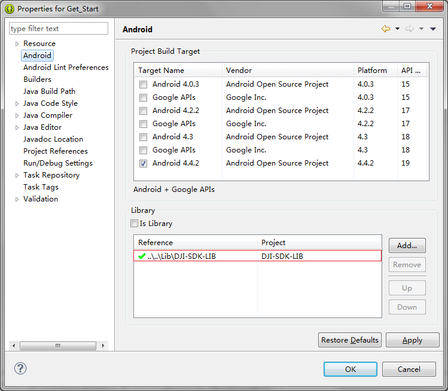
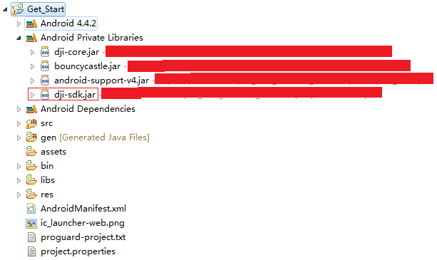
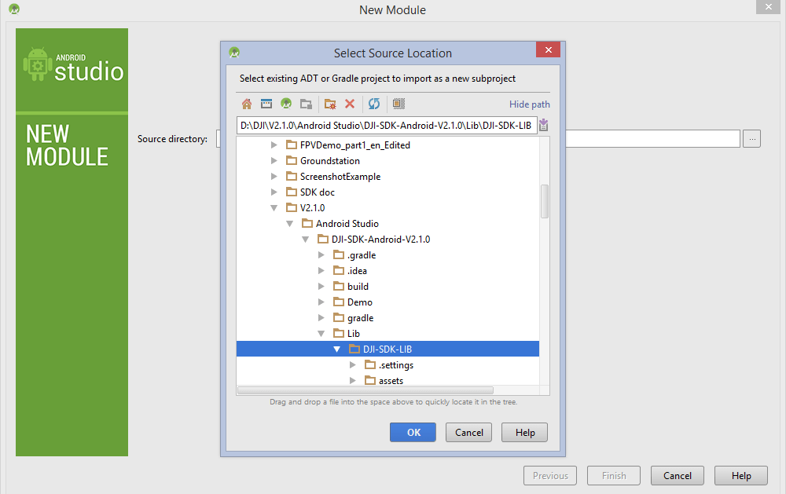
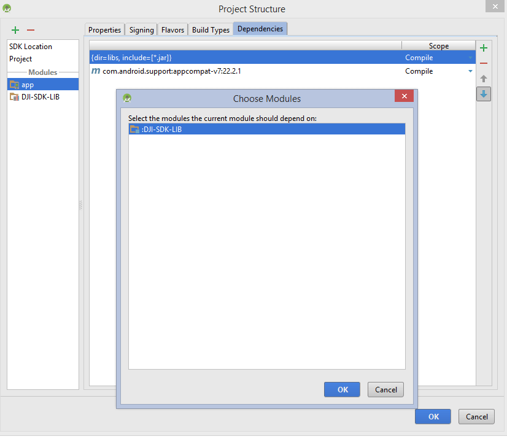
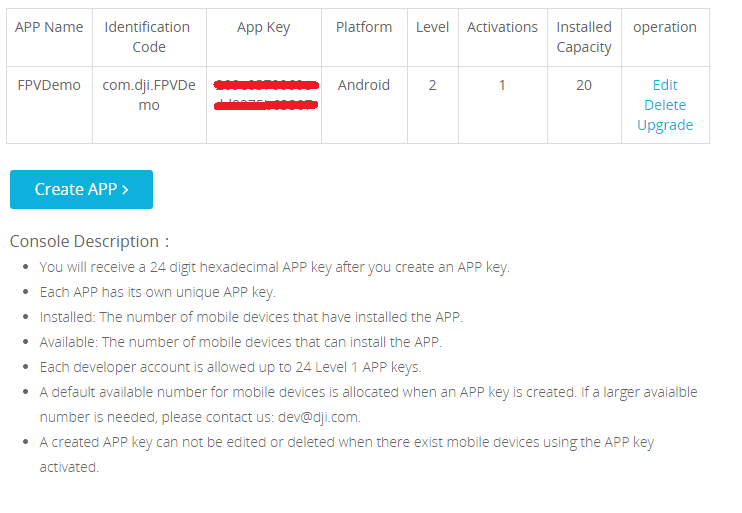
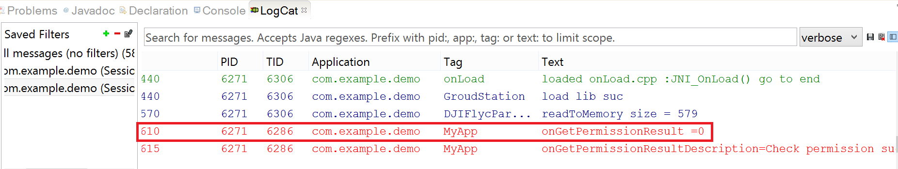
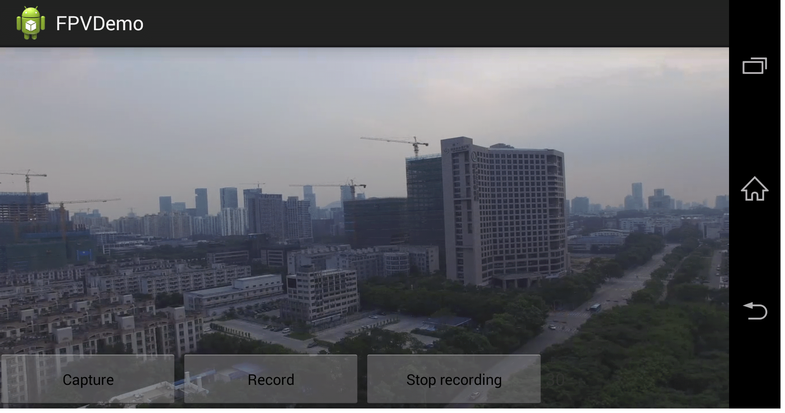

# Creating a Camera Application

<!-- toc -->

*If you come across any mistakes or bugs in this tutorial, please let us know using a Github issue, a post on the DJI forum, or commenting in the Gitbook. Please feel free to send us Github pull request and help us fix any issues. However, all pull requests related to document must follow the [document style](https://github.com/dji-sdk/Mobile-SDK-Tutorial/issues/19)*

---

You can download the demo project from this **Github Page**. If you want to have a better reading experience, please check our [Gitbook Version](http://dji-dev.gitbooks.io/mobile-sdk-tutorials/content/en/Android/FPVDemo/FPVDemo_en.html)

We **strongly** recommend that you download the final project code and have it open as reference as you work through this tutorial.

## Preparation

(1) Download the Mobile SDK for Android from the following URL: 
<https://developer.dji.com/mobile-sdk/downloads>

(2) Update the firmware of the aircraft (Phantom 3 Professional, Phantom 3 Advanced or Inspire 1) through the URL: <https://developer.dji.com/mobile-sdk/downloads>(
*Refer to "Updating the Aircraft Firmware": <http://download.dji-innovations.com/downloads/phantom_3/en/How_to_Update_Firmware_en.pdf> for instructions on updating the firmware.*)

(3) Set up an Android development environment (if you do not yet have one). Throughout this tutorial we will be using Eclipse 4.2.2, which you can download here: <https://eclipse.org/downloads/packages/eclipse-classic-422/junosr2>. Once Eclipse is installed, you will then have to install the Eclipse Android Development Tool Plug-In, with instructions on how to do so found here: http://developer.android.com/intl/zh-TW/sdk/installing/installing-adt.html

*Note: Google's support for Android Development Tools in Eclipse is ending. If you would like to complete this demo using Eclipse as we have, or if you have already completed this demo in Eclipse, you can find instructions to migrate your project into Android Studio here: <https://developer.android.com/intl/zh-TW/sdk/installing/migrate.html>. If you would like to follow this tutorial using Android Studio, the mobile SDK folder contains an Android Studio library as well as an Eclipse one. Instructions on how to import the SDK library are given for both Eclipse and Android Studio below. However, we recommend that you follow this guide using the provided installation of Eclipse, and migrate your project afterwards, as we cannot ensure that results in Android Studio will be identical to those displayed in this tutorial.*

## Setting up your Programming Environment

### Eclipse

(1) Create a new 'Android Application Project'. Name the Application, Project and Package as you please. Under the 'Create Activity' page of the project set-up, create a blank activity, and name it 'FPVActivity'. The layout activity should automatically fill out with 'activity_fpv'.

(2) Unzip the SDK package downloaded from the DJI website. Import the folder **Lib** (Eclipse\DJI-SDK-Android-V2.1.0) into Eclipse (File -> Import -> Android -> Existing Android Code into Workspace). Next, add the imported file to your library (right click on your project -> Select "**Properties**" -> Select "**Android**" -> Add).

(3) The imported library should now be located as shown below:

### Android Studio

(1) Start a new Android Studio Project. Give the application any name you like. Hit 'next' until you reach the 'Customize the Activity' page, where you should name your activity 'FPVActivity'. The layout name should automatically fill out with 'activity_fpv'. Press 'Finish'.

(2) Unzip the SDK package downloaded from the DJI website. Go to File -> New -> Import Module. In the 'Source Directory' field, find the DJI-SDK-LIB folder location (Android Studio\DJI-SDK-Android-V2.1.0\Lib\DJI-SDK-LIB). Press Finish.

*Note: The folder 'Android Studio' is found in the SDK package downloaded from the DJI website. The library used in the demo project code is from the 'Eclipse' folder in the same SDK package, so if you are working in Android Studio make sure that you are using the correct library, found in the 'Android Studio' folder. For your convenience the SDK package download link is reproduced here <https://developer.dji.com/mobile-sdk/downloads>*

Next, right click on the 'app' module in the file directory to the left, and click 'Open Module Settings". Navigate to the 'Dependencies' tab. Press the green plus sign, click 'Module Dependency', and select ':DJI-SDK-LIB'. Press 'OK' to confirm. After Gradle finishes rebuilding, you're environment will be ready!

## Activating your App

(1) Register for an account at <https://developer.dji.com/register>. Once registered, click on your name in the upper right corner. Click on 'Mobile SDK', then 'Create APP' and fill out the creation form. Type in your project's package name in the 'Identification Code' field.

(2) Copy both the **<uses-permission ... >** lines of code and the highlighted meta-data element into your **AndroidManifest.xml** file for activation, as shown below.  

Fill in the **android:value** field with the APP KEY that you have applied for from <https://developer.dji.com/en/user/mobile-sdk/>.

In your FPVActivity.java file, add the following variable in the FPVActivity class.

~~~java
private static final String TAG = "MyApp";
~~~

We'll be using this string to identify log errors that are relevant to our activation.

In your onCreate method, add the following code. It looks like a lot, but the bulk of it is a single method called **DJIDrone.checkPermission()**. This method will verify your app by checking the information we just added to our **AndroidManifest.xml** file against DJI's servers. If this if your first time running your app, and the verification comes through, the app will also be activated.

~~~java
	new Thread(){
		public void run(){
			try{
				DJIDrone.checkPermission(getApplicationContext(), new DJIGerneralListener(){
					@Override
					public void onGetPermissionResult(int result){
						if(result == 0) {
							// show success
							Log.e(TAG, "onGetPermissionResult ="+result);
							Log.e(TAG, 
"onGetPermissionResultDescription="+DJIError.getCheckPermissionErrorDescription(result));
						} else {
							// show errors
							Log.e(TAG, "onGetPermissionResult ="+result);
							Log.e(TAG, 
"onGetPermissionResultDescription="+DJIError.getCheckPermissionErrorDescription(result));
						}
					}
				});
			} catch (Exception e) {
        			// TODO Auto-generated catch block
        			e.printStackTrace();
        		}
		}
	}.start();
~~~

Let's break this chunk of code down. You'll notice that we place all our code inside of a thread. The reason for this is because **checkPermission()** performs network operations, and such processes must be handled in a thread, lest the whole app freezes up while waiting for the network operation to complete.

**checkPermission()** takes in two parameters: a context, and a **DJIGerneralListener()** object. **DJIGerneralListener()** is an interface containing one method: **onGetPermissionResult()**, which acts as a callback function that handles what to do when **checkPermission()** receives a response. 

~~~java
@Override
public void onGetPermissionResult(int result){
	if(result == 0) {
		// show success
		Log.e(TAG, "onGetPermissionResult ="+result);
		Log.e(TAG, 
"onGetPermissionResultDescription="+DJIError.getCheckPermissionErrorDescription(result));
	} else {
		// show errors
		Log.e(TAG, "onGetPermissionResult ="+result);
		Log.e(TAG, 
"onGetPermissionResultDescription="+DJIError.getCheckPermissionErrorDescription(result));
	}
}
~~~

**onGetPermissionResult()** takes in an integer **result**. **result** is an error code returned to your app. If the error code is 0 the app has been successfully verified. If not, **onGetPermissionResult()** prints out the appropriate error message using the Log. When developing your own apps, you can decide whether this is how you'd like to handle the error code.

(3) Run your project code on an Android device or Android emulator to complete the activation procedure. Instructions for running your code can be found here: <http://developer.android.com/intl/zh-TW/tools/building/building-eclipse.html>

Check the 'LogCat' panel at the bottom of your coding environment window for a return message. You will be able to identify the return message by its 'Tag' field, where it should say "MyApp".

Check the error code against the table below:

Error Code  	  | Description 
------------- | -------------
0   | Check permission successful
-1  | Cannot connect to Internet
-2  | Invalid app key
-3  | Get permission data timeout
-4  | Device uuid not match
-5  | Project package name does not match the app 	   key's identification code
-6  | App key is forbidden
-7  | Activated device number is up to the maximum 		available one
-8  | App key's platform is not correct
-9  | App key does not exist
-10 | App key has no permission
-11 | Server parser failed
-12 | Error in server obtaining uuid
-13 | Server app package name abnormal
-14 | Server parsing activation data failed
-15 | AES 256 encryption unsupported
-16 | AES 256 encryption failed
-17 | Get device uuid failed
-18 | Empty app key
-1000 | Server error 

If you have received an error code that is not 0, follow the instructions below:

1. Ensure that you have access to the internet
2. Ensure that, when creating an app on the [DJI Developer website](https://developer.dji.com), you have filled out the 'Identification Code' field with your project package name 
3. Ensure that APP KEY has not reach its installed capacity limit. If this does not solve the issue, refer to the table below for further troubleshooting.
If you have further questions, contact our mobile SDK support by sending emails to <sdk@dji.com>

## Adding Android Open Accessory (AOA) support

The latest firmware on DJI's newest remote controllers connect to external devices using USB Accessory, rather than USB Debugging older models do. This requires Android Open Accessory (AOA) support. In the future, when you go on to create your own apps to use with DJI drones, you will need to add AOA support as shown below. This set up is also backwards compatible with older remotes.

(1) Modify **AndroidManifest.xml** to set **.DJIAoaActivity** as the main activity, so that it will act as the entry point when your app starts up. To do this, find the **<activity ... >** element, and change the **android:name** value from **.FPVActivity** to **.DJIAoaActivity**.

Under the 'manifest' element in your **AndroidManifest.xml** file, add the following lines of code:
~~~xml
<uses-feature android:name="android.hardware.usb.accessory" android:required="false" />
<uses-feature android:name="android.hardware.usb.host" android:required="false" />
~~~ 

Under the 'application' element, add the following line of code:
~~~xml
uses-library android:name="com.android.future.usb.accessory"
~~~
Your **AndroidManifest.xml** file should look something like this:

~~~xml
	...
	
	<uses-feature android:name="android.hardware.usb.accessory" android:required="false" />
	<uses-feature android:name="android.hardware.usb.host" android:required="false" />
	<application
		android:label="@string/app_name"
		android:theme="@style/AppTheme">
		
		<uses-library android:name="com.android.future.usb.accessory" />
	...
		<activity
			android:name=".DJIAoaActivity"
			android:configChanges="orientation|screenSize|keyboardHidden|keyboard"
			android:screenOrientation="sensorLandscape" >
			
			<intent-filter>
				<action android:name="android.intent.action.MAIN" />
				<category android:name="android.intent.category.LAUNCHER" />
			</intent-filter>
			
			<intent-filter>
				<action android:name="android.hardware.usb.action.USB_ACCESSORY_ATTACHED" />
			</intent-filter>
			
			<meta-data
				android:name = "android.hardware.usb.action.USB_ACCESSORY_ATTACHED"
				android:resource = "@xml/accessory_filter" />
		</activity>
~~~

(2) Create a new Android Activity Page, using **DJIAoaActivity** as the activity name. (Right click on your package -> New -> Other -> Android -> Android Activity). In your newly created **DJIAoaActivity.java** file, locate the '**onCreate()** method, and replace the code inside with the following code to enable AOA support.

~~~java
	private static boolean isStarted = false;
	...
	@Override
	protected void onCreate(Bundle savedInstanceState){
		super.onCreate(savedInstanceState);
		setContentView(new View(this));
		
		if (isStarted) {
			//Do nothing
		} else {
			isStarted = true;
			ServiceManager.getInstance();
			UsbAccessoryService.registerAoaReceiver(this); 
			Intent intent = new Intent(DJIAoaActivity.this, FPVActivity.class);
			startActivity(intent);
		}
		
		Intent aoaIntent = getIntent();
		if(aoaIntent != null) {
			String action = aoaIntent.getAction();
			if (action==UsbManager.ACTION_USB_ACCESSORY_ATTACHED || action == Intent.ACTION_MAIN){
				Intent attachedIntent = new Intent();
				attachedIntent.setAction(DJIUsbAccessoryReceiver.ACTION_USB_ACCESSORY_ATTACHED);
				sendBroadcast(attachedIntent);
			}
		}
		finish();
	}
	...
~~~ 

Let's run through this code bit by bit.

We created the variable **isStarted** so that the set up only occurs when the app starts up.

~~~java
	private static boolean isStarted = false;
~~~

~~~java
	if (isStarted) {
		//Do nothing
	} else {
		isStarted = true;
		ServiceManager.getInstance();
		UsbAccessoryService.registerAoaReceiver(this); 
		Intent intent = new Intent(DJIAoaActivity.this, FPVActivity.class);
		startActivity(intent);
	}
~~~

If the app is being started up, we set up an intent that will take us to our main activity **FPVActivity**, as shown in these two lines of code:

~~~java
Intent intent = new Intent(DJIAoaActivity.this, FPVActivity.class);
startActivity(intent);
~~~

*Note: In the future when you are adding AOA support for your own apps to use with the DJI remote, you will want to replace "FPVActivity.class" with the name of your own class. Additionally, if you haven't named your first activity 'FPVActivity', you'll need to put the name you chose here instead.*

Next we have the code responsible for sending a broadcast to connect to the remote.

~~~java
Intent aoaIntent = getIntent();
if(aoaIntent != null) {
	String action = aoaIntent.getAction();
	if (action==UsbManager.ACTION_USB_ACCESSORY_ATTACHED || action == Intent.ACTION_MAIN){
		Intent attachedIntent = new Intent();
		attachedIntent.setAction(DJIUsbAccessoryReceiver.ACTION_USB_ACCESSORY_ATTACHED);
		sendBroadcast(attachedIntent);
	}
}
~~~

This code first gets the action of the intent that brought us here. This allows us to check if the app is being opened, or if the device the app is on has just been plugged into a DJI remote. If so, we send a broadcast to set up the connection between the app and the DJI remote.

~~~java
if (action==UsbManager.ACTION_USB_ACCESSORY_ATTACHED || action == Intent.ACTION_MAIN){
	// Send broadcast
}
~~~ 

(3) Additionally, we will need to pause the AOA data connection service when the app paused (when it is partially visible), and resume the data connection when the app is resumed (when it is once again fully visible). 

Create a new Android Activity Page called **DemoBaseActivity**, and add the following code. This code allows you to pause or resume the AOA data connection service when the **onPause()** or **onResume()** lifecycle callbacks are called.

This will be our project's base activity. Change your **FPVActivity** class header so that it now extends **DemoBaseActivity**, rather than **Activity**.

~~~java
	...
	@Override
	protected void onResume(){
		super.onResume();
		ServiceManager.getInstance().pauseService(false); // Resume the service
	} 
	
	@Override
	protected void onPause() {
		super.onPause();
		ServiceManager.getInstance().pauseService(true); // Pause the service
	}
~~~	
	
## Implementing the First Person View

We're almost there! We've activated our app and set up a verification mechanism, as well as established a data connection between our app and the DJI remote controller. All that's left to do is create a live video feed of the Drone's camera to be viewed through the app.

(1) Before we start using the SDK API, we have to initiate it according to the type of the aircraft we are using. Unfortunately, as of now, there exists no way to automatically detect what type of aircraft the app is connected to. This means that we must either hardcode in which type of drone we are using, or have some sort of user input. For the purposes of this tutorial, we will be hardcoding in that we are using the Inspire 1. However, our method includes a **switch()** statement that allows us to change a simple variable **DroneCode** in our code if other drones are to be used.

In 'FPVActivity.java', in the FPVActivity class, add the variable below.

~~~java
private int DroneCode;
~~~

Import the following package.

~~~java
import dji.sdk.api.DJIDroneTypeDef.DJIDroneType;
~~~

Add two lines of code in the 'onCreate' method as shown below. Additionally, within the 'FPVActivity' class, copy the 'onInitSDK' method shown below.

~~~java
	@Override
	protected void onCreate(Bundle savedInstanceState){
		
		...
		DroneCode = 1; 
		onInitSDK(DroneCode);
		...
	}
	
	private void onInitSDK(int type){
		switch(type){
			case 0: {
				DJIDrone.initWithType(this.getApplicationContext(), DJIDroneType.DJIDrone_Vision);
				// The SDK initiation for Phantom 2 Vision or Vision Plus 
				break;
			}
			case 1: {
				DJIDrone.initWithType(this.getApplicationContext(), DJIDroneType.DJIDrone_Inspire1); 
				// The SDK initiation for Inspire 1 or Phantom 3 Professional.
				break;
			}
			case 2: {
				DJIDrone.initWithType(this.getApplicationContext(), DJIDroneType.DJIDrone_Phantom3_Advanced);
				// The SDK initiation for Phantom 3 Advanced
				break;
			}
			case 3: {
				DJIDrone.initWithType(this.getApplicationContext(), DJIDroneType.DJIDrone_M100);
				// The SDK initiation for Matrice 100.
				break;
			}
			default:{
				break;
			}
		}
	}
	
	...
~~~

(2) After initiating the SDK API, we have to connect to the drone. In the 'onCreate' method, use the following line of code to connect to the aircraft. Make sure to call this method only after the code that activates your APP key.

~~~java
	DJIDrone.connectToDrone(); // Connect to the drone
~~~	

(3) Now that the API has been initiated and we have connected to the drone, we can connect a video feed. If these two processes are not carried out first, calling API functions will have no result. Locate the **activity_fpv.xml** file (res/layout/activity_fpv.xml) and add the following **DjiGLSurfaceView** element code in the **activity_fpv.xml** file.

~~~xml
	<dji.sdk.widget.DjiGLSurfaceView
		android:id="@+id/DjiSurfaceView_02"
		android:layout_width="fill_parent"
		android:layout_height="fill_parent" />
~~~	

This view is responsible for displaying the video stream from the DJI drone.

In your 'FPVActivity.java' file, in the FPVActivity class, add the objects as shown below.

~~~java
private DJIReceivedVideoDataCallBack mReceivedVideoDataCallBack = null;
private DjiGLSurfaceView mDjiGLSurfaceView;
~~~

Add the following code in the 'onCreate' method, making sure to insert it after where you call the connectToDrone() method.

~~~java
	@Override
	protected void onCreate(Bundle savedInstanceState) {
		super.onCreate(savedInstanceState);
		setContentView(R.layout.activity_fpv);
		
		...
		
		mDjiGLSurfaceView = (DjiGLSurfaceView)findViewById(R.id.DjiSurfaceView_02);
		mDjiGLSurfaceView.start();

		mReceivedVideoDataCallBack = new DJIReceivedVideoDataCallBack(){
			@Override
			public void onResult(byte[] videoBuffer, int size){
				mDjiGLSurfaceView.setDataToDecoder(videoBuffer, size);
			}
		};
		DJIDrone.getDjiCamera().setReceivedVideoDataCallBack(mReceivedVideoDataCallBack);
	}
~~~	

Let's work our way through this chunk of code.

Firstly, we associate our object **mDjiGLSurfaceView** with the **DjiSurfaceView_02** element we created in our **activity_fpv.xml** file just before.

~~~java
mDjiGLSurfaceView = (DjiGLSurfaceView)findViewById(R.id.DjiSurfaceView_02);
mDjiGLSurfaceView.start();
~~~

We then set our callback function **mReceivedVideoDataCallBack** that we just declared above.

~~~java
mReceivedVideoDataCallBack = new DJIReceivedVideoDataCallBack(){
@Override
public void onResult(byte[] videoBuffer, int size){
	mDjiGLSurfaceView.setDataToDecoder(videoBuffer, size);
	}
};
~~~

**mReceivedVideoDataCallBack** will now take the raw video data (raw H264 format) from the Drone's camera and feed it to our **DjiGLSurfaceView** element to handle, where a decoder provided by DJI will decode the raw data, upon which the **DjiGLSurfaceView** element will display it in our app window!

Finally, we set this callback function to be called when we receive data from the Drone's camera.

~~~java
DJIDrone.getDjiCamera().setReceivedVideoDataCallBack(mReceivedVideoDataCallBack);
~~~

(4) Finally, when the app is closed, we must terminate the data decoding process, then destroy our **DjiGLSurfaceView** element. If an **onDestroy()** method does not already exist, create the method using the code below. Otherwise, copy the code below into your existing **onDestroy()** method.

~~~java
	...
	
	@Override
	protected void onDestroy() {
		if (DJIDrone.getDjiCamera() != null) {
			DJIDrone.getDjiCamera().setReceivedVideoDataCallBack(null);
		}
		mDjiGLSurfaceView.destroy();
		
		...
	}
~~~

It is extremely important that in the **onDestroy()** method, you first terminate the video data processing operation by setting the callback function to **null** before you destroy the **DjiGLSurfaceView** object, as shown above. If you destroy the surface view first, the callback function will continue to send data to an object that does not exist, which could crash your app.

Conversely, in your **onCreate()** method, you must start the **DjiGLSurfaceView** object before assigning the callback function, for the same reason (refer to the beginning of step (3) where we modify the **onCreate()** method for an example of where we have already done this).

## Connecting to your Aircraft

After you have built and run the project successfully, you can now connect your mobile device to an aircraft to check the FPV. Follow the appropriate instructions for your specific aircraft model:

### 1. Connecting to a DJI Inspire 1 or Phantom 3 Professional/Advanced:

1. Turn on your remote controller, then turn on your aircraft

2. Connect your mobile device to the remote controller using a USB cable. Tap your own app and a message window "Choose an app for the USB device" will prompt.

3. Tap "OK" when the message window prompts "Allow the app to access the USB accessory".

4. Tap "OK" when the activation alert displays.

5. You are ready to use the FPV View app. 

### 2. Connecting to a DJI Phantom 2 Vision+ or Phantom 2 Vision:
	
1. Turn on your remote controller, then turn on your aircraft.

2. Ensure that the mobile device has access to the Internet. Tap the app to activate and select "OK" when the activation is done.

3. Turn on the Wi-Fi range extender

4. Turn on the Wi-Fi on your mobile device and connect to the Wi-Fi network of Phantom-xxxxxx (where xxxxxx is your range extender’s SSID number)

5. You are ready to use the FPV View app.

## Checking your results
If you can see the live video stream in the app, congratulations! You've succesfully implemented a First Person View!

## Creating a Handler

We will be using a handler to display error and confirmation messages. Set up this handler by copying the code below into your FPVActivity class:

~~~java
private Handler handler = new Handler(new Handler.Callback() {
        
        @Override
        public boolean handleMessage(Message msg) {
            switch (msg.what) {
                case SHOWDIALOG:
                    showMessage(getString(R.string.demo_activation_message_title),(String)msg.obj); 
                    break;
                case SHOWTOAST:
                    Toast.makeText(FPVActivity.this, (String)msg.obj, Toast.LENGTH_SHORT).show();
                    break;
                default:
                    break;
            }
            return false;
        }
    });
    
    private Handler handlerTimer = new Handler();
    Runnable runnable = new Runnable(){
        @Override
        public void run() {
        // handler自带方法实现定时器
        try {

            handlerTimer.postDelayed(this, TIME);
            viewTimer.setText(Integer.toString(i++));

        } catch (Exception e) {
            // TODO Auto-generated catch block
            e.printStackTrace();
        }
        }
    };
~~~

## Implementing the Capture Function

The **private void captureAction()** function is used to take photos. In our source code, we implement a "Capture" button which calls this function whenever pressed.

~~~java
	 // function for taking photo
    private void captureAction(){
        
        CameraMode cameraMode = CameraMode.Camera_Capture_Mode;
        // Set the cameraMode as Camera_Capture_Mode. All the available modes can be seen in
        // DJICameraSettingsTypeDef.java
        DJIDrone.getDjiCamera().setCameraMode(cameraMode, new DJIExecuteResultCallback(){

            @Override
            public void onResult(DJIError mErr)
            {
                
                String result = "errorCode =" + mErr.errorCode + "\n"+"errorDescription =" + DJIError.getErrorDescriptionByErrcode(mErr.errorCode);
                if (mErr.errorCode == DJIError.RESULT_OK) {
                    CameraCaptureMode photoMode = CameraCaptureMode.Camera_Single_Capture; 
                    // Set the camera capture mode as Camera_Single_Capture. All the available modes 
                    // can be seen in DJICameraSettingsTypeDef.java
                    
                    DJIDrone.getDjiCamera().startTakePhoto(photoMode, new DJIExecuteResultCallback(){

                        @Override
                        public void onResult(DJIError mErr)
                        {
                            
                            String result = "errorCode =" + mErr.errorCode + "\n"+"errorDescription =" + DJIError.getErrorDescriptionByErrcode(mErr.errorCode);
                            handler.sendMessage(handler.obtainMessage(SHOWTOAST, result));  // display the returned message in the callback               
                        }
                        
                    }); // Execute the startTakePhoto API if successfully setting the camera mode as
                    	// Camera_Capture_Mode 
                } else {
                    handler.sendMessage(handler.obtainMessage(SHOWTOAST, result)); 
                    // Show the error when setting fails
                }
                
            }
            
        });
                   
    }
~~~

That was a lot of code we just threw at you, so let's break it down.

The first thing we need to do is define a CameraMode enum, which we will use to set the mode of the camera onboard our DJI Drone.

~~~java
CameraMode cameraMode = CameraMode.Camera_Capture_Mode;
~~~

The reason we defined this enum 'cameraMode' was so that we could pass it as a parameter for the **setCameraMode()** function that we are about to call. **setCameraMode()** sets the mode of the DJI drone's camera (Capture Mode, Playback Mode, Record Mode etc.). **setCameraMode()** takes in two parameters:

**setCameraMode(DJICameraSettingsTypeDef.CameraMode mode, DJIExecuteResultCallback mCall)**

The first parameter, a CameraMode enum, tells the function what mode to set the camera to. In this case, we tell it to set the camera to Capture Mode.
The second parameter is a callback function, which is run after **setCameraMode()** attempts to set the camera mode. The callback function is reproduced, in brief, below.

~~~java
new DJIExecuteResultCallback(){

            @Override
            public void onResult(DJIError mErr)
            {

                String result = "errorCode =" + mErr.errorCode + "\n"+"errorDescription =" + DJIError.getErrorDescriptionByErrcode(mErr.errorCode);
                if (mErr.errorCode == DJIError.RESULT_OK) {
                    // Take a photo!
                } else {
                    handler.sendMessage(handler.obtainMessage(SHOWTOAST, result)); 
                    // Show the error when setting fails
                }

            }

        });
~~~

The callback function takes in a confirmation signal from the drone, in the form of a DJIError object 'mErr'. If the error code given by 'mErr' matches the value DJIError.RESULT_OK, then code to take the photo is carried out. Else, a handler will show an appropriate error message depending on the error code.

Within the callback function we have code to tell the drone to take a photo.

~~~java
CameraCaptureMode photoMode = CameraCaptureMode.Camera_Single_Capture; 
// Set the camera capture mode as Camera_Single_Capture. All the available modes 
// can be seen in DJICameraSettingsTypeDef.java

DJIDrone.getDjiCamera().startTakePhoto(photoMode, new DJIExecuteResultCallback(){

	@Override
    public void onResult(DJIError mErr)
    {
    	String result = "errorCode =" + mErr.errorCode + "\n"+"errorDescription =" + DJIError.getErrorDescriptionByErrcode(mErr.errorCode);
        handler.sendMessage(handler.obtainMessage(SHOWTOAST, result));  // display the returned message in the callback               
    }
}); // Execute the startTakePhoto API if successfully setting the camera mode as
                        // Camera_Capture_Mode
~~~

If this code looks familiar, it's because it follows a structure almost identical to the larger function it is a part of! First we create a CameraCaptureMode enum called 'photoMode'. When the drone takes a photo, this enum instructs the drone whether it should take a single photo, a burst of photos, or a continuous stream of photos. For this example we'll be taking a single photo at a time.

The **startTakePhoto()** method tells the drone's camera to take a photo. Just like the **setCameraMode()** function, it takes in an enum and a callback function. We've just gone over what the enum it takes in is.
The callback function uses a handler to display a message giving an error code and an error description after the drone's camera attempts to take a photo. If a photo has successfully been taken, this message will confirm it.

And that's it! Add a "Capture" button into your app which calls this method, and give it a go!

## Implement the Recording Function

The **recordAction()** method is almost identical to the **captureAction()** method we just implemented, with just a few key differences! Take a quick look at the code below:

~~~java
	 // function for starting recording
    private void recordAction(){
        // Set the cameraMode as Camera_Record_Mode.
        CameraMode cameraMode = CameraMode.Camera_Record_Mode;
        DJIDrone.getDjiCamera().setCameraMode(cameraMode, new DJIExecuteResultCallback(){
		 
            @Override
            public void onResult(DJIError mErr)
            {
                
                String result = "errorCode =" + mErr.errorCode + "\n"+"errorDescription =" + DJIError.getErrorDescriptionByErrcode(mErr.errorCode);
                if (mErr.errorCode == DJIError.RESULT_OK) {
                    
                    //Call the startRecord API
                    DJIDrone.getDjiCamera().startRecord(new DJIExecuteResultCallback(){

                        @Override
                        public void onResult(DJIError mErr)
                        {
                            
                            String result = "errorCode =" + mErr.errorCode + "\n"+"errorDescription =" + DJIError.getErrorDescriptionByErrcode(mErr.errorCode);
                            handler.sendMessage(handler.obtainMessage(SHOWTOAST, result));  // display the returned message in the callback               
                            
                        }
                        
                    }); // Execute the startTakePhoto API
                } else {
                    handler.sendMessage(handler.obtainMessage(SHOWTOAST, result));
                }
                
            }
            
        });
        
    }
~~~

Notice that the cameraMode enum has been set as **Camera_Record_Mode** because this time we want the camera to record.

~~~java
// Set the cameraMode as Camera_Record_Mode.
CameraMode cameraMode = CameraMode.Camera_Record_Mode;
~~~

Additionally, within our callback function, we call **startRecord()** instead of **startTakePhoto()**. **startRecord()** only takes in one parameter, a callback function. It does not take in an enum as **startTakePhoto()** does, as there is only one recording mode.

## Implement the Stopping Recording Function

Once the camera starts recording, we need some way to tell it to stop! That's where **stopRecord()** comes in. The code below should look quite familiar to you by now:

~~~java
	 // function for stopping recording
    private void stopRecord(){
    // Call the API
        DJIDrone.getDjiCamera().stopRecord(new DJIExecuteResultCallback(){

            @Override
            public void onResult(DJIError mErr)
            {
                
                String result = "errorCode =" + mErr.errorCode + "\n"+"errorDescription =" + DJIError.getErrorDescriptionByErrcode(mErr.errorCode);
                handler.sendMessage(handler.obtainMessage(SHOWTOAST, result));

            }
            
        });
    }

~~~

You can now add a 'Record' and 'Stop Recording' button to your app, and have them call **recordAction()** and **stopRecord()** respectively. Build and run the project, and it should look something like the screenshot below:

Then congratulations! Your Aerial First Person View Android app is complete, capable of viewing your DJI Drone's video feed, as well as remotely taking picture and videos!

## Viewing your Images

Unfortunately, this tutorial does not include guidance on viewing photos and videos onboard your DJI Drone's SD card. However, if you would like to see the pictures and videos you took through your brand new app, you can download DJI's Pilot App, found here:
<https://play.google.com/store/apps/details?id=dji.pilot&hl=en>
Alternatively, you can search for the app in the Google Play Store under the name 'DJI Pilot'. 

## Summary

You’ve come a long way in this tutorial: you’ve learned how to use the DJI Mobile SDK to show the FPV view of the aircraft's camera and control the camera of a DJI platform. These features, **Capture** and **Record** are the most basic and common features in a typical drone mobile app. However, if you want to create a drone app that is more fancy, you still have a long way to go. More advanced features would include previewing the photo and video in the SD Card, showing the OSD data of the aircraft and so on. Hope you enjoyed this tutorial, stay tuned for our next one!

