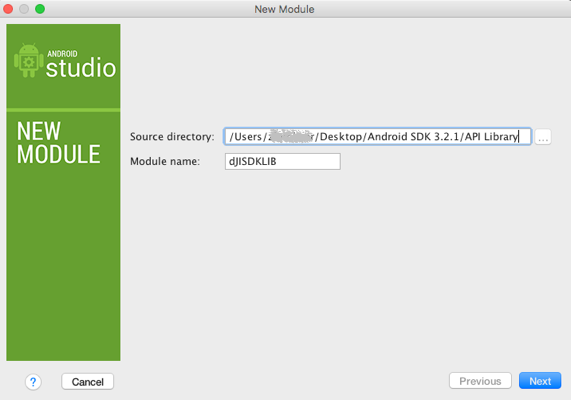
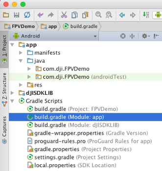
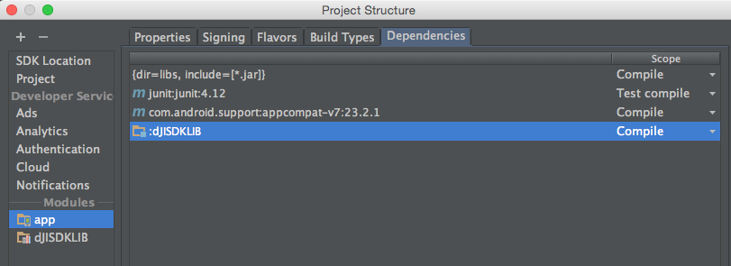
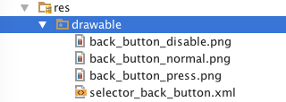
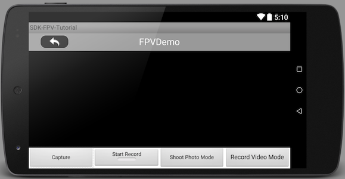
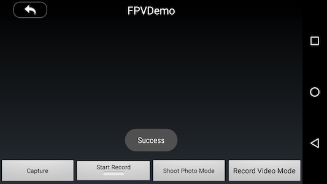
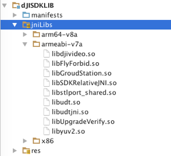
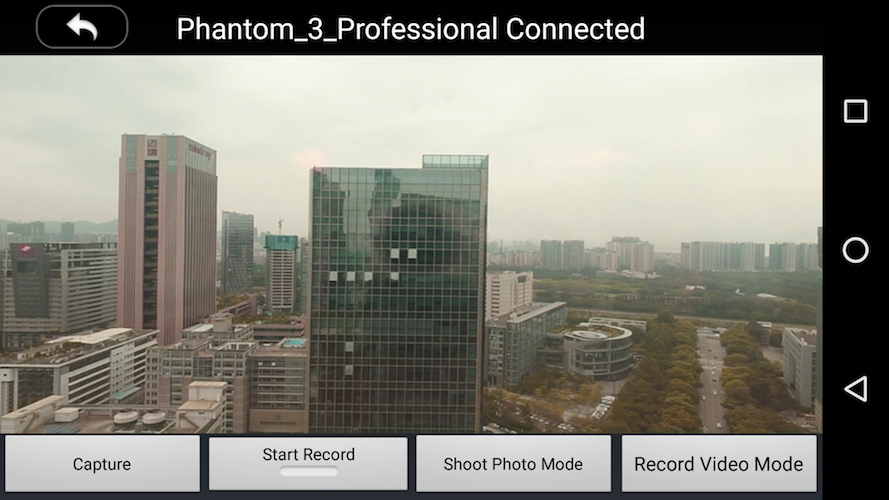

# Creating a Camera Application

<!-- toc -->

*If you come across any mistakes or bugs in this tutorial, please let us know using a Github issue or a post on the DJI forum, or commenting in the Gitbook. Please feel free to send us Github pull request and help us fix any issues. However, all pull requests related to document must follow the [document style](https://github.com/dji-sdk/Mobile-SDK-Tutorial/issues/19)*

---

This tutorial is designed for you to gain a basic understanding of the DJI Mobile SDK. It will implement the FPV view and two basic camera functionalities: **Take Photo** and **Record video**.

   You can download the entire project for this tutorial from this **Github Page**.
## Preparation

### Download the SDK

You can download the latest Android SDK from here: <https://developer.dji.com/mobile-sdk/downloads/>

### Upgrade Firmware
You can download the firmware of the product (Phantom 3 Series, Inspire 1, Inspire Pro, M100, OSMO, etc) through here: <https://developer.dji.com/mobile-sdk/downloads/>.

Then check this [How to Update the Firmware](http://dl.djicdn.com/downloads/phantom_3/en/Firmware_Update_Guide_en_v1.4.pdf) tutorial for instructions on updating the Phantom 3 Professional's firmware.

### Setup Android Development Environment
   
  Throughout this tutorial we will be using Android Studio 2.1, which you can download from here: <http://developer.android.com/sdk/index.html>.

## Implementing the UI of Application

In our previous tutorial [**Importing and Activating DJI SDK in Android Studio Project**](https://github.com/DJI-Mobile-SDK/Android-ImportAndActivateSDKInAndroidStudio), you have learned how to import the DJI Android SDK into your Android Studio project and activate your application. If you haven't read that previously, please take a look at it. Once you've done that, let's continue to create the project.

### Importing the Framework and Libraries

 **1**. Open Android Studio and select **File -> New -> New Project** to create a new project, named 'FPVDemo'. Enter the company domain and package name (Here we use "com.dji.FPVDemo") you want and press Next. Set the mimimum SDK version as `API 19: Android 4.4 (KitKat)` for "Phone and Tablet" and press Next. Then select "Empty Activity" and press Next. Lastly, leave the Activity Name as "MainActivity", and the Layout Name as "activity_main", Press "Finish" to create the project.
 
 **2**. Unzip the Android SDK package downloaded from [DJI Developer Website](http://developer.dji.com/mobile-sdk/downloads/). Go to **File -> New -> Import Module**, enter the "API Library" folder location of the downloaded Android SDK package in the "Source directory" field. A "dJISDKLib" name will show in the "Module name" field. Press Next and Finish button to finish the settings.
 
 
 
 **3**. Next, double click on the "build.gradle(Module: app)" in the project navigator to open it and replace the content with the following:
 
~~~java
apply plugin: 'com.android.application'

android {
    compileSdkVersion 23
    buildToolsVersion '23.0.2'

    defaultConfig {
        applicationId "com.dji.FPVDemo"
        minSdkVersion 19
        targetSdkVersion 23
        versionCode 1
        versionName "1.0"
    }
    buildTypes {
        release {
            minifyEnabled false
            proguardFiles getDefaultProguardFile('proguard-android.txt'), 'proguard-rules.pro'
        }
    }
}

dependencies {
    compile fileTree(include: ['*.jar'], dir: 'libs')
    compile 'com.android.support:appcompat-v7:23.3.0'
    compile 'com.android.support:design:23.3.0'
    compile project(':dJISDKLIB')
}
~~~
 
 In the code above, we modify its dependencies by adding `compile project(':dJISDKLIB')` in the "dependencies" part at the bottom, and change the compileSdkVersion, buildToolsVersion number, etc. 
  
 
 
 Then, select the **Tools -> Android -> Sync Project with Gradle Files** on the top bar and wait for Gradle project sync finish.
 
 **4**. Let's right click on the 'app' module in the project navigator and click "Open Module Settings" to open the Project Struture window. Navigate to the "Dependencies" tab, you should find the "dJISDKLIB" appear in the list. Your SDK environmental setup should be ready now!
 
 
 
 **5**. Now, open the MainActivity.java file in `com.dji.FPVDemo` package and add `import dji.sdk.SDKManager.DJISDKManager;` at the bottom of the import classes section as shown below:
 
~~~java
package com.dji.FPVDemo;

import android.support.v7.app.AppCompatActivity;
import android.os.Bundle;
import dji.sdk.SDKManager.DJISDKManager;
~~~

  Wait for a few seconds and check if the words turn red, if they remain gray color, it means you can use DJI Android SDK in your project successfully now.

### Building the Layouts of Activity

#### 1. Creating FPVDemoApplication Class

Right-click on the package `com.dji.FPVDemo` in the project navigator and choose **New -> Java Class**, Type in "FPVDemoApplication" in the Name field and select "Class" as Kind field content.
   
Next, Replace the code of the "FPVDemoApplication.java" file with the following:
   
~~~java
package com.dji.FPVDemo;
import android.app.Application;

public class FPVDemoApplication extends Application{

    @Override
    public void onCreate() {
        super.onCreate();
    }
}
~~~

Here, we override the onCreate() method. We can do some settings when the application is created here.

#### 2. Implementing MainActivity Class

The MainActivity.java file is created by Android Studio by default. Let's replace the code of it with the following:

~~~java
public class MainActivity extends Activity implements TextureView.SurfaceTextureListener, View.OnClickListener {

    protected TextView mConnectStatusTextView;

    protected TextureView mVideoSurface = null;
    private Button mCaptureBtn, mShootPhotoModeBtn, mRecordVideoModeBtn;
    private ToggleButton mRecordBtn;
    private TextView recordingTime;

    @Override
    protected void onCreate(Bundle savedInstanceState) {
        super.onCreate(savedInstanceState);
        
        // When the compile and target version is higher than 22, please request the
        // following permissions at runtime to ensure the
        // SDK work well.
        if (Build.VERSION.SDK_INT >= Build.VERSION_CODES.M) {
            ActivityCompat.requestPermissions(this,
                    new String[]{Manifest.permission.WRITE_EXTERNAL_STORAGE, Manifest.permission.VIBRATE,
                            Manifest.permission.INTERNET, Manifest.permission.ACCESS_WIFI_STATE,
                            Manifest.permission.WAKE_LOCK, Manifest.permission.ACCESS_COARSE_LOCATION,
                            Manifest.permission.ACCESS_NETWORK_STATE, Manifest.permission.ACCESS_FINE_LOCATION,
                            Manifest.permission.CHANGE_WIFI_STATE, Manifest.permission.MOUNT_UNMOUNT_FILESYSTEMS,
                            Manifest.permission.READ_EXTERNAL_STORAGE, Manifest.permission.SYSTEM_ALERT_WINDOW,
                            Manifest.permission.READ_PHONE_STATE,
                    }
                    , 1);
        }
        
        setContentView(R.layout.activity_main);
        initUI();
    }

    @Override
    public void onResume() {
        super.onResume();
    }

    @Override
    public void onPause() {
        super.onPause();
    }

    @Override
    public void onStop() {
        super.onStop();
    }

    public void onReturn(View view){
        this.finish();
    }

    @Override
    protected void onDestroy() {
        super.onDestroy();
    }

    @Override
    public void onSurfaceTextureAvailable(SurfaceTexture surface, int width, int height) {
    }

    @Override
    public void onSurfaceTextureSizeChanged(SurfaceTexture surface, int width, int height) {
    }

    @Override
    public boolean onSurfaceTextureDestroyed(SurfaceTexture surface) {
        return false;
    }

    @Override
    public void onSurfaceTextureUpdated(SurfaceTexture surface) {
    }

    private void initUI() {
        mConnectStatusTextView = (TextView) findViewById(R.id.ConnectStatusTextView);
        // init mVideoSurface
        mVideoSurface = (TextureView)findViewById(R.id.video_previewer_surface);

        recordingTime = (TextView) findViewById(R.id.timer);
        mCaptureBtn = (Button) findViewById(R.id.btn_capture);
        mRecordBtn = (ToggleButton) findViewById(R.id.btn_record);
        mShootPhotoModeBtn = (Button) findViewById(R.id.btn_shoot_photo_mode);
        mRecordVideoModeBtn = (Button) findViewById(R.id.btn_record_video_mode);
        
        if (null != mVideoSurface) {
            mVideoSurface.setSurfaceTextureListener(this);
        }
        
        mCaptureBtn.setOnClickListener(this);
        mRecordBtn.setOnClickListener(this);
        mShootPhotoModeBtn.setOnClickListener(this);
        mRecordVideoModeBtn.setOnClickListener(this);

        recordingTime.setVisibility(View.INVISIBLE);

        mRecordBtn.setOnCheckedChangeListener(new CompoundButton.OnCheckedChangeListener() {
            @Override
            public void onCheckedChanged(CompoundButton buttonView, boolean isChecked) {
            
           }
        });
    }

    @Override
    public void onClick(View v) {
        switch (v.getId()) {
            case R.id.btn_capture:{
                break;
            }
            case R.id.btn_shoot_photo_mode:{
                break;
            }
            case R.id.btn_record_video_mode:{
                break;
            }
            default:
                break;
        }
    }
    
}
~~~

In the code shown above, we implement the following features:

**1.** Create the layout UI elements variables, including a TextureView `mVideoSurface`, three Buttons `mCaptureBtn`, `mShootPhotoModeBtn`, `mRecordVideoModeBtn`, one Toggle Button `mRecordBtn` and a TextView `recordingTime `.

**2.** In the `onCreate()` method, we request several permissions at runtime to ensure the SDK works well when the compile and target SDK version is higher than 22(Like Android Marshmallow 6.0 device and API 23).

**3.** Then invoke the `initUI()` method to initialize UI variables. And implement the `setOnClickListener()` method of Button for all the Buttons. Also implement the `setOnCheckedChangeListener()` method for Toggle Button.

**4.** Override the `onClick()` method to implement the three Buttons' click actions.

#### 3. Implementing the MainActivity Layout

Open the **activity_main.xml** layout file and replace the code with the following:

~~~xml
<RelativeLayout xmlns:android="http://schemas.android.com/apk/res/android"
    xmlns:tools="http://schemas.android.com/tools"
    android:layout_width="match_parent"
    android:layout_height="match_parent"
    android:orientation="vertical">

    <RelativeLayout
        android:id="@+id/main_title_rl"
        android:layout_width="fill_parent"
        android:layout_height="40dp"
        android:background="@color/black_overlay" >

        <ImageButton
            android:id="@+id/ReturnBtnCamera"
            android:layout_width="wrap_content"
            android:layout_height="35dp"
            android:layout_alignParentLeft="true"
            android:layout_centerVertical="true"
            android:layout_marginLeft="20dp"
            android:adjustViewBounds="true"
            android:background="@android:color/transparent"
            android:onClick="onReturn"
            android:scaleType="centerInside"
            android:src="@drawable/selector_back_button" />

        <TextView
            android:id="@+id/ConnectStatusTextView"
            android:layout_width="wrap_content"
            android:layout_height="wrap_content"
            android:layout_centerInParent="true"
            android:text=""
            android:textColor="@android:color/white"
            android:textSize="21sp" />
    </RelativeLayout>

    <TextureView
        android:id="@+id/video_previewer_surface"
        android:layout_width="match_parent"
        android:layout_height="match_parent"
        android:layout_below="@id/main_title_rl"
        android:layout_gravity="center"
        android:layout_centerHorizontal="true"
        android:layout_above="@+id/linearLayout" />

    <LinearLayout
        android:layout_width="match_parent"
        android:layout_height="wrap_content"
        android:orientation="horizontal"
        android:layout_alignParentBottom="true"
        android:id="@+id/linearLayout">
        <Button
            android:id="@+id/btn_capture"
            android:layout_width="0dp"
            android:layout_weight="1"
            android:layout_gravity="center_vertical"
            android:layout_height="wrap_content"
            android:text="Capture"
            android:textSize="12sp"/>

        <ToggleButton
            android:id="@+id/btn_record"
            android:layout_width="0dp"
            android:layout_height="wrap_content"
            android:text="Start Record"
            android:textOff="Start Record"
            android:textOn="Stop Record"
            android:layout_weight="1"
            android:layout_gravity="center_vertical"
            android:textSize="12dp"
            android:checked="false" />

        <Button
            android:id="@+id/btn_shoot_photo_mode"
            android:layout_width="0dp"
            android:layout_weight="1"
            android:layout_height="wrap_content"
            android:layout_gravity="center_vertical"
            android:text="Shoot Photo Mode"
            android:textSize="12sp"/>

        <Button
            android:id="@+id/btn_record_video_mode"
            android:layout_width="0dp"
            android:layout_height="wrap_content"
            android:text="Record Video Mode"
            android:layout_weight="1"
            android:layout_gravity="center_vertical" />

    </LinearLayout>

    <TextView
        android:id="@+id/timer"
        android:layout_width="150dp"
        android:layout_weight="1"
        android:layout_height="wrap_content"
        android:layout_gravity="center_vertical"
        android:layout_marginTop="23dp"
        android:gravity="center"
        android:textColor="#ffffff"
        android:layout_alignTop="@+id/video_previewer_surface"
        android:layout_centerHorizontal="true" />

</RelativeLayout>
~~~

  In the xml file, firstly, we implement the RelativeLayout element. We declare an ImageButton(id: ReturnBtnCamera) element to exit the application, and a TextView(id: ConnectStatusTextView) element to show the connection status text. 
  
  Next, create a TextureView(id: video_previewer_surface) element to show the live video stream from the camera. Moreover, we implement a LinearLayout element to create the "Capture" Button(id: btn_capture), "Record" ToggleButton(id: btn_record), "Shoot Photo Mode" Button(id: btn_shoot_photo_mode) and "Record Video Mode" Button(id: btn_record_video_mode).
  
  Lastly, we create a TextView(id: timer) element to show the record video time.

#### 4. Configuring the Resource XMLs

  Once you finish the above steps, let's copy all the images file from this Github sample project's **drawable** folder (**app->src->main->res->drawable**) to the same folder in your project.
  
  
  
  Moreover, open the colors.xml file and update the content as shown below:
  
~~~xml
<?xml version="1.0" encoding="utf-8"?>
<resources>
    <color name="colorPrimary">#3F51B5</color>
    <color name="colorPrimaryDark">#303F9F</color>
    <color name="colorAccent">#FF4081</color>
    <color name="black_overlay">#66000000</color>
</resources>
~~~

Now, if you open the activity_main.xml file, and click on the **Design** tab on the bottom left, you should see the preview screenshot of MainActivity as shown below:

For more details, please check the Github source code of this tutorial.

## Registering the Application

After you finish the above steps, let's register our application with the **App Key** you apply from DJI Developer Website. If you are not familiar with the App Key, please check [Creating an DJI App Tutorial](http://developer.dji.com/mobile-sdk/get-started/Register-Download).

**1.** Let's open the AndroidManifest.xml file and add the following elements on top of the **application** element:

~~~xml
<uses-sdk
    <uses-permission android:name="android.permission.VIBRATE" />
    <uses-permission android:name="android.permission.INTERNET" />
    <uses-permission android:name="android.permission.ACCESS_WIFI_STATE" />
    <uses-permission android:name="android.permission.WAKE_LOCK" />
    <uses-permission android:name="android.permission.ACCESS_COARSE_LOCATION" />
    <uses-permission android:name="android.permission.ACCESS_NETWORK_STATE" />
    <uses-permission android:name="android.permission.ACCESS_FINE_LOCATION" />
    <uses-permission android:name="android.permission.CHANGE_WIFI_STATE" />
    <uses-permission android:name="android.permission.MOUNT_UNMOUNT_FILESYSTEMS" />
    <uses-permission android:name="android.permission.WRITE_EXTERNAL_STORAGE" />
    <uses-permission android:name="android.permission.READ_EXTERNAL_STORAGE" />
    <uses-permission android:name="android.permission.SYSTEM_ALERT_WINDOW" />
    <uses-permission android:name="android.permission.READ_PHONE_STATE" />

    <uses-feature android:name="android.hardware.camera" />
    <uses-feature android:name="android.hardware.camera.autofocus" />
    <uses-feature
        android:name="android.hardware.usb.host"
        android:required="false" />
    <uses-feature
        android:name="android.hardware.usb.accessory"
        android:required="true" />
~~~

Here, we request permissions that the application must be granted in order for it to register DJI SDK correctly. Also we declare the camera and usb hardwares which is used by the application.

Moreover, let's add the following elements as childs of element on top of the "MainActivity" activity element as shown below:

~~~xml
<!-- DJI SDK -->
<uses-library android:name="com.android.future.usb.accessory" />
<meta-data
    android:name="com.dji.sdk.API_KEY"
    android:value="Please enter your APP Key here." />

<activity
    android:name="dji.sdk.SDKManager.DJIAoaControllerActivity"
    android:theme="@android:style/Theme.Translucent" >
    <intent-filter>
        <action android:name="android.hardware.usb.action.USB_ACCESSORY_ATTACHED" />
    </intent-filter>

    <meta-data
        android:name="android.hardware.usb.action.USB_ACCESSORY_ATTACHED"
        android:resource="@xml/accessory_filter" />
</activity>
<service android:name="dji.sdk.SDKManager.DJIGlobalService" >
</service>
<!-- DJI SDK -->
~~~

In the code above, you should substitude your **App Key** of the application for "Please enter your App Key here." in the **value** attribute under the `android:name="com.dji.sdk.API_KEY"` attribute.

**2.** After you finish the steps above, open the "FPVDemoApplication.java" file and replace the code with the same file in the Github Source Code, here we explain the important parts of it:

~~~java
@Override
public void onCreate() {
    super.onCreate();
    mHandler = new Handler(Looper.getMainLooper());
    //This is used to start SDK services and initiate SDK.
    DJISDKManager.getInstance().initSDKManager(this, mDJISDKManagerCallback);
}

/**
 * When starting SDK services, an instance of interface DJISDKManager.DJISDKManagerCallback will be used to listen to 
 * the SDK Registration result and the product changing.
 */
private DJISDKManager.DJISDKManagerCallback mDJISDKManagerCallback = new DJISDKManager.DJISDKManagerCallback() {

    //Listens to the SDK registration result
    @Override
    public void onGetRegisteredResult(DJIError error) {
        if(error == DJISDKError.REGISTRATION_SUCCESS) {
	        DJISDKManager.getInstance().startConnectionToProduct();
	        Handler handler = new Handler(Looper.getMainLooper());
	        handler.post(new Runnable() {
	            @Override
	            public void run() {
	                Toast.makeText(getApplicationContext(), "Success", Toast.LENGTH_LONG).show();
	            }
	        });
	        
        } else {
        
            Handler handler = new Handler(Looper.getMainLooper());
            handler.post(new Runnable() {
                @Override
                public void run() {
                    Toast.makeText(getApplicationContext(), "register sdk fails, check network is available", Toast.LENGTH_LONG).show();
                }
            });
        }
        Log.e("TAG", error.toString());
    }

    //Listens to the connected product changing, including two parts, component changing or product connection changing.
    @Override
    public void onProductChanged(DJIBaseProduct oldProduct, DJIBaseProduct newProduct) {

        mProduct = newProduct;
        if(mProduct != null) {
            mProduct.setDJIBaseProductListener(mDJIBaseProductListener);
        }

        notifyStatusChange();
    }
};

private DJIBaseProductListener mDJIBaseProductListener = new DJIBaseProductListener() {

    @Override
    public void onComponentChange(DJIComponentKey key, DJIBaseComponent oldComponent, DJIBaseComponent newComponent) {

        if(newComponent != null) {
            newComponent.setDJIComponentListener(mDJIComponentListener);
        }
        notifyStatusChange();
    }

    @Override
    public void onProductConnectivityChanged(boolean isConnected) {

        notifyStatusChange();
    }
};
~~~

Here, we implement several features:
  
1. We override the `onCreate()` method to initialize the DJISDKManager.
2. Implement the two interface methods of `DJISDKManagerCallback`. You can use the `onGetRegisteredResult()` method to check the Application registration status and show text message here. Using the `onProductChanged()` method, we can check the product connection status and invoke the `notifyStatusChange()` method to notify status changes.
3. Implement the two interface methods of `DJIBaseProductListener`. You can use the `onComponentChange()` method to check the product component change status and invoke the `notifyStatusChange()` method to notify status changes. Also, you can use the `onProductConnectivityChanged()` method to notify the product connectivity changes.

Now let's build and run the project and install it to your Android device. If everything goes well, you should see the "success" textView like the following screenshot when you register the app successfully.

> **Important:** Please check if the "armeabi-v7a", "arm64-v8a" and "x86" lib folders has been added to your jnLibs folder in **dJISDKLib** successfully before testing resgistering the app. 
> 
> 
> 

For more details of registering your application, please check this tutorial: [Importing and Activating DJI SDK in Android Studio Project](https://github.com/DJI-Mobile-SDK/Android-ImportAndActivateSDKInAndroidStudio).

## Implementing the First Person View

Now, let's continue to declare the `TAG` and `mReceivedVideoDataCallBack` variables as shown below:

~~~java
private static final String TAG = MainActivity.class.getName();
protected DJICamera.CameraReceivedVideoDataCallback mReceivedVideoDataCallBack = null;
~~~

Then add the following codes at the bottom of `onCreate()` method:

~~~java
@Override
protected void onCreate(Bundle savedInstanceState) {
    super.onCreate(savedInstanceState);
    setContentView(R.layout.activity_main);
    initUI();

    // The callback for receiving the raw H264 video data for camera live view
    mReceivedVideoDataCallBack = new DJICamera.CameraReceivedVideoDataCallback() {

        @Override
        public void onResult(byte[] videoBuffer, int size) {
            if(mCodecManager != null){
                // Send the raw H264 video data to codec manager for decoding
                mCodecManager.sendDataToDecoder(videoBuffer, size);
            }else {
                Log.e(TAG, "mCodecManager is null");
            }
        }
    };

    // Register the broadcast receiver for receiving the device connection's changes.
    IntentFilter filter = new IntentFilter();
    filter.addAction(FPVDemoApplication.FLAG_CONNECTION_CHANGE);
    registerReceiver(mReceiver, filter);
}
~~~

In the code above, we initialize the `mReceivedVideoDataCallBack` variable using DJICamera's `CameraReceivedVideoDataCallback()`. Inside the callback, we override its `onResult()` method to get the raw H264 video data and send them to `mCodecManager` for decoding.  Next, we register the broadcast receiver for receiving the device connection changes status. 

Moreover, let's create the "BroadcastReceiver" and override its `onReceive()` method to update the title Bar and invoke the `onProductChange()` method:

~~~java
protected BroadcastReceiver mReceiver = new BroadcastReceiver() {
    @Override
    public void onReceive(Context context, Intent intent) {
        updateTitleBar();
        onProductChange();
    }
};
~~~

Next, let's implement the `updateTitleBar()` and `onProductChange()` methods： 

~~~java
private void updateTitleBar() {
    if(mConnectStatusTextView == null) return;
    boolean ret = false;
    DJIBaseProduct product = FPVDemoApplication.getProductInstance();
    if (product != null) {
        if(product.isConnected()) {
            //The product is connected
            mConnectStatusTextView.setText(FPVDemoApplication.getProductInstance().getModel() + " Connected");
            ret = true;
        } else {
            if(product instanceof DJIAircraft) {
                DJIAircraft aircraft = (DJIAircraft)product;
                if(aircraft.getRemoteController() != null && aircraft.getRemoteController().isConnected()) {
                    // The product is not connected, but the remote controller is connected
                    mConnectStatusTextView.setText("only RC Connected");
                    ret = true;
                }
            }
        }
    }
    if(!ret) {
        // The product or the remote controller are not connected.
//            mConnectStatusTextView.setText("Disconnected");
    }
}

protected void onProductChange() {
    initPreviewer();
}
~~~

In the `updateTitleBar()` method, we check the product connection status and modify the text on `mConnectStatusTextView`.

Furthermore, let's implement two important methods to show and reset the live video stream on our `mVideoSurface` TextureView:

~~~java
private void initPreviewer() {

    DJIBaseProduct product = FPVDemoApplication.getProductInstance();

    if (product == null || !product.isConnected()) {
        showToast(getString(R.string.disconnected));
    } else {
        if (null != mVideoSurface) {
            mVideoSurface.setSurfaceTextureListener(this);
        }
        if (!product.getModel().equals(DJIBaseProduct.Model.UnknownAircraft))   
        {
            DJICamera camera = product.getCamera();
            if (camera != null){
                // Set the callback
                camera.setDJICameraReceivedVideoDataCallback(mReceivedVideoDataCallBack);
            }
        }
    }
}

private void uninitPreviewer() {
    DJICamera camera = FPVDemoApplication.getCameraInstance();
    if (camera != null){
        // Reset the callback
        FPVDemoApplication.getCameraInstance().setDJICameraReceivedVideoDataCallback(null);
    }
}
~~~

In the `initPreviewer()` method, firstly, we check the product connection status and invoke the `setSurfaceTextureListener()` method of TextureView to set texture listener to MainActivity. Then get the DJICamera variable by invoking the `getCamera()` method of DJIBaseProduct and set `mReceivedVideoDataCallBack` as its "DJICameraReceivedVideoDataCallback". So once the camera is connected and receive video data, it will show on the `mVideoSurface` TextureView.

Moreover, we implement the `uninitPreviewer()` method to reset DJICamera's "DJICameraReceivedVideoDataCallback" to null.

Now, let's override the four SurfaceTextureListener interface methods as shown below:

~~~java
@Override
public void onSurfaceTextureAvailable(SurfaceTexture surface, int width, int height) {
    Log.e(TAG, "onSurfaceTextureAvailable");
    if (mCodecManager == null) {
        mCodecManager = new DJICodecManager(this, surface, width, height);
    }
}

@Override
public void onSurfaceTextureSizeChanged(SurfaceTexture surface, int width, int height) {
    Log.e(TAG, "onSurfaceTextureSizeChanged");
}

@Override
public boolean onSurfaceTextureDestroyed(SurfaceTexture surface) {
    Log.e(TAG,"onSurfaceTextureDestroyed");
    if (mCodecManager != null) {
        mCodecManager.cleanSurface();
        mCodecManager = null;
    }

    return false;
}

@Override
public void onSurfaceTextureUpdated(SurfaceTexture surface) {
//        Log.e(TAG, "onSurfaceTextureUpdated");
}
~~~

We init the `mCodecManager` variable in the `onSurfaceTextureAvailable()` method, then reset the `mCodecManager` and invoke its `cleanSurface()` method to reset the surface data.

For more detail implementations, please check the Github source code of this tutorial.

## Connecting to the Aircraft or Handheld Device

After you finish the steps above, you can now connect your mobile device to your DJI Aircraft to use the application, like checking the FPV View. Here are the guidelines:

* In order to connect to a DJI Phantom 4, Inspire 1, Phantom 3 Professional, etc:

  **1**. First, turn on your remote controller.
  
  **2**. Then, turn on the power of the DJI aircraft.
  
  **3**. Connect your iOS device to the remote controller using the lightning cable.
  
  **4**. Run the application and wait for a few seconds, you will be able to view the live video stream from your aircraft's camera based on what we've finished of the application so far!
  
* In order to connect to Phantom 3 Standard, Phantom 3 4K, or OSMO:

  **1**. First, turn on your remote controller or OSMO.
   
  **2**. Then, turn on the power of the DJI aircraft. (If you are using Phantom 3 Standard or Phantom 3 4K)
  
  **3**. Search for the WiFi of the aircraft's remote controller or OSMO and connect your iOS device to it.
  
  **4**. Run the application and wait for a few seconds, you will be able to view the live video stream from your aircraft or OSMO's camera based on what we've finished of the application so far!
  
## Enjoying the First Person View

If you can see the live video stream in the application, congratulations! Let's move forward.

 

## Implementing the Capture function

Now, let's override the `onClick()` method to implement the capture button click action:

~~~java
@Override
public void onClick(View v) {

    switch (v.getId()) {
        case R.id.btn_capture:{
            captureAction();
            break;
        }
        default:
            break;
    }
}
~~~

Then implement the `captureAction()` method as shown below:

~~~objc
// Method for taking photo
private void captureAction(){

    CameraMode cameraMode = CameraMode.ShootPhoto;

    final DJICamera camera = FPVDemoApplication.getCameraInstance();
    if (camera != null) {

        CameraShootPhotoMode photoMode = CameraShootPhotoMode.Single; // Set the camera capture mode as Single mode
        camera.startShootPhoto(photoMode, new DJICompletionCallback() {

            @Override
            public void onResult(DJIError error) {
                if (error == null) {
                    showToast("take photo: success");
                } else {
                    showToast(error.getDescription());
                }
            }

        }); // Execute the startShootPhoto API
    }
}
~~~

In the code above, we firstly create a "CameraMode" variable and assign `CameraMode.ShootPhoto` to it. Next, create a "CameraShootPhotoMode" variable and assign "CameraShootPhotoMode.Single" to it. The camera work mode for ShootPhoto has several modes within its definition. You can use "AEBCapture", "Burst", "HDR", etc for "CameraShootPhotoMode", for more details, please check **DJICameraSettingsDef.CameraShootPhotoMode**.

Next, implement the `startShootPhoto()` method of DJICamera to control the camera to shoot photo. We override its `onResult()` method to get the result and show related text to users.

  Build and run your project and then try the shoot photo function. If the screen flash after your press the **Capture** button, your capture fuction should work now.

## Implementing the Record function

### Switching Camera Mode

Before we go ahead to implement the record action method, let's implement the switch Camera Mode feature. Improve the `onClick()` method by adding button click actions for `mShootPhotoModeBtn` and `mRecordVideoModeBtn` as follows:

~~~java
@Override
public void onClick(View v) {

    switch (v.getId()) {
        case R.id.btn_capture:{
            captureAction();
            break;
        }
        case R.id.btn_shoot_photo_mode:{
            switchCameraMode(CameraMode.ShootPhoto);
            break;
        }
        case R.id.btn_record_video_mode:{
            switchCameraMode(CameraMode.RecordVideo);
            break;
        }
        default:
            break;
    }
}
~~~

Next, implement the `switchCameraMode()` method:

~~~java
private void switchCameraMode(CameraMode cameraMode){

    DJICamera camera = FPVDemoApplication.getCameraInstance();
    if (camera != null) {
        camera.setCameraMode(cameraMode, new DJICompletionCallback() {
            @Override
            public void onResult(DJIError error) {

                if (error == null) {
                    showToast("Switch Camera Mode Succeeded");
                } else {
                    showToast(error.getDescription());
                }
            }
        });
        }

}
~~~

In the code above, we invoke the `setCameraMode()` method of DJICamera and assign the `CameraMode` parameter to it. Then override the `onResult()` method to show the change camera mode result to the users.

### Working on the Record Action

Once we finish the switch camera mode feature, we can now implement the record feature. Let's improve the `initUI()` method by add the following code at the bottom of it:

~~~java
mRecordBtn.setOnCheckedChangeListener(new CompoundButton.OnCheckedChangeListener() {
    @Override
    public void onCheckedChanged(CompoundButton buttonView, boolean isChecked) {
        if (isChecked) {
            recordingTime.setVisibility(View.VISIBLE);
            startRecord();

        } else {
            recordingTime.setVisibility(View.INVISIBLE);
            stopRecord();
        }
    }
});
~~~

Here, we implement the `setOnCheckedChangeListener()` method of ToggleButton `mRecordBtn` and override its `onCheckedChanged()` method to check the `isChecked` variable value, which means the toggle state of the button, and invoke the `startRecord()` and `stopRecord()` methods relatively.

Next, implement the `startRecord()` and `stopRecord()` methods as shown below:

~~~java
// Method for starting recording
private void startRecord(){

    CameraMode cameraMode = CameraMode.RecordVideo;
    final DJICamera camera = FPVDemoApplication.getCameraInstance();
    if (camera != null) {
        camera.startRecordVideo(new DJICompletionCallback(){
            @Override
            public void onResult(DJIError error)
            {
                if (error == null) {
                    showToast("Record video: success");
                }else {
                    showToast(error.getDescription());
                }
            }
        }); // Execute the startRecordVideo API
    }
}

// Method for stopping recording
private void stopRecord(){

    DJICamera camera = FPVDemoApplication.getCameraInstance();
    if (camera != null) {
        camera.stopRecordVideo(new DJICompletionCallback(){

            @Override
            public void onResult(DJIError error)
            {
                if(error == null) {
                    showToast("Stop recording: success");
                }else {
                    showToast(error.getDescription());
                }
            }
        }); // Execute the stopRecordVideo API
    }

}
~~~

In the code above, we invoke the `startRecordVideo()` and `stopRecordVideo()` methods of DJICamera to implement the start record and stop record features. And show the result messages to our user by override the `onResult()` methods.

Lastly, when the video start recording, we should show the recording time info to our users. So let's add the following code to the bottom of `onCreate()` method as follows:

~~~java
DJICamera camera = FPVDemoApplication.getCameraInstance();

    if (camera != null) {
        camera.setDJICameraUpdatedSystemStateCallback(new DJICamera.CameraUpdatedSystemStateCallback() {
            @Override
            public void onResult(DJICamera.CameraSystemState cameraSystemState) {
                if (null != cameraSystemState) {

                    int recordTime = cameraSystemState.getCurrentVideoRecordingTimeInSeconds();
                    int minutes = (recordTime % 3600) / 60;
                    int seconds = recordTime % 60;

                    final String timeString = String.format("%02d:%02d", minutes, seconds);
                    final boolean isVideoRecording = cameraSystemState.isRecording();

                    MainActivity.this.runOnUiThread(new Runnable() {
                        @Override
                        public void run() {
                            recordingTime.setText(timeString);
                             /*
                              * Update recordingTime TextView visibility and mRecordBtn's check state
                              */
                                if (isVideoRecording){
                                    recordingTime.setVisibility(View.VISIBLE);
                                }else
                                {
                                    recordingTime.setVisibility(View.INVISIBLE);
                                }
                        }
                    });
                }
            }
        });
    }
~~~

Here, we implement the `setDJICameraUpdatedSystemStateCallback()` of DJICamera and override the `onResult()` method to get the current camera system state, we can call the `getCurrentVideoRecordingTimeInSeconds()` method of "DJICamera.CameraSystemState" to get the record time info. Before we show the record time info to our users, we should convert it from seconds to "00:00" format including minutes and seconds. Lastly, we update the TextView `recordingTime` variable's text value with the latest record time info and update the visibility of `recordingTime` TextView in UI Thread.

For more details, please check the Github source code of this tutorial.

Now, let's build and run the project and check the functions. You can try to play with the **Capture**, **Record** and **Switch Camera WorkMode** functions, here is a gif animation to demo these three functions:
   
  
   
  Congratulations! Your Aerial FPV iOS app is complete, you can now use this app to control the camera of your Phantom 3 Professional. 

## Summary
   
   In this tutorial, you’ve learned how to use DJI Mobile SDK to show the FPV View from the aircraft's camera and control the camera of DJI's Aircraft to shoot photo and record video. These are the most basic and common features in a typical drone mobile app: **Capture** and **Record**. However, if you want to create a drone app which is more fancy, you still have a long way to go. More advanced features should be implemented, including previewing the photo and video in the SD Card, showing the OSD data of the aircraft and so on. Hope you enjoy this tutorial, and stay tuned for our next one!
   